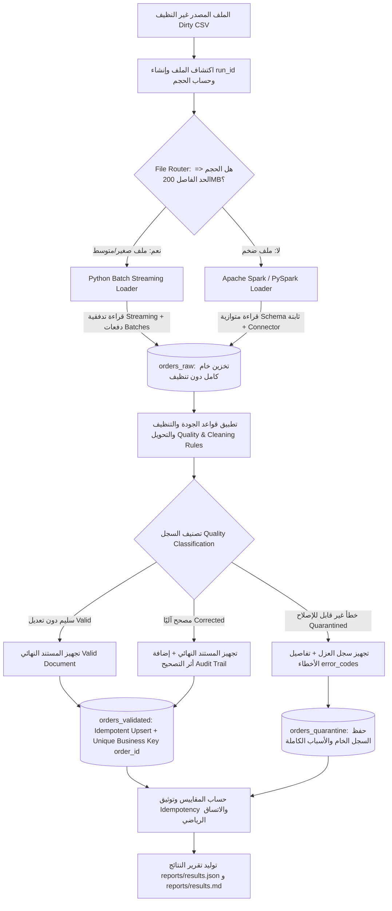
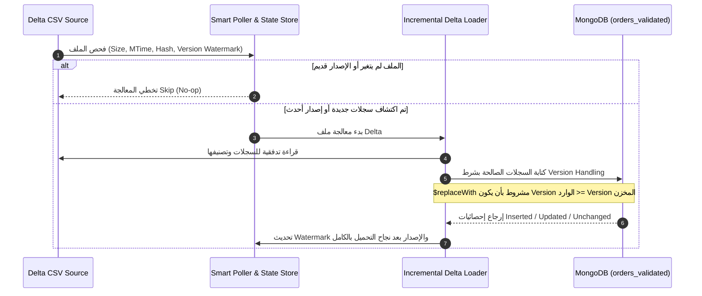

# المعمارية الفنية لخط البيانات الهجين (Hybrid Data Pipeline Architecture)

يوثق هذا الملف المعمارية الشاملة لمنظومة معالجة وتحميل بيانات الطلبات الضخمة، والقرارات الهندسية المتبعة لتطبيق نمط ELT، واختيار المحركات، وإثبات Idempotency، وتنفيذ المسار المتقدم B (التحميل التزايدي وإدارة الإصدارات).

---

## 1. مخطط تدفق البيانات العام (End-to-End ELT Pipeline Architecture)

---

## 2. تفاصيل المجموعات وقواعد التحقق في MongoDB (Collections & Schemas)

### 2.1 مجموعة `orders_raw` (طبقة البيانات الخام)
- **الغرض**: الحفاظ على نسخة أصلية كاملة غير معدلة من جميع السجلات الواردة، كتاريخ تتبع زمني (Historical Lineage).
- **القيود**: **خالية تمامًا** من أي Schema Validator أو Unique Index لمنع رفض أي سجل غير نظيف مهما كانت درجة تلفه.
- **الحقول الأساسية**:
  - `run_id`: معرف تشغيل فريد يربط السجل بدفعة الإدخال.
  - `source_file`: المسار المطلق للملف المصدر.
  - `source_row_number`: رقم الصف في الملف المصدر لسهولة التتبع والمطابقة.
  - `ingested_at`: الطابع الزمني للتحميل بتوقيت UTC.
  - `engine_used`: المحرك الذي نفذ التحميل (`python_batch` أو `pyspark`).
  - `raw_record`: كائن JSON يحتوي على الحقول الخام الأصلية بقيمها النصية كما وردت.

### 2.2 مجموعة `orders_validated` (طبقة البيانات التجارية المعتمدة)
- **الغرض**: استقبال السجلات السليمة (`valid`) والمصححة (`corrected`) الصالحة للاستخدام في التحليلات والأنظمة التجارية.
- **الفهارس**:
  - `unique_order_id`: فهرس فريد على حقل `order_id` يمنع تكرار أي طلب تجاريًا.
- **قواعد التحقق (JSON Schema Validation)**:
  - تطبيق تحقق صارم (`strict`) على وجود `order_id`، `customer_id`، و`quality_status` ضمن القيم المعتمدة (`valid` / `corrected`).

### 2.3 مجموعة `orders_quarantine` (طبقة العزل)
- **الغرض**: تخزين السجلات التي تعذر تصحيحها بأمان، مع بيان أسباب العزل التفصيلية دون حذف أي سجل.
- **الحقول الإضافية**:
  - `error_codes`: قائمة برموز الأخطاء المكتشفة (مثل `INVALID_IMPOSSIBLE_DATE`, `CORRUPTED_ITEMS_JSON`).
  - `error_details`: تفاصيل توضيحية لسبب عزل السجل.
  - `raw_record`: السجل الخام الأصلي لمراجعته يدويًا لاحقًا.

---

## 3. موجّه الملفات التلقائي (File Router Architecture)

تعتمد نقطة التشغيل الرئيسية على فحص حجم الملف لاختيار المحرك الأمثل:

$$\text{Engine} = \begin{cases} \text{Python Batch Streaming} & \text{if } \text{file\_size\_mb} \le \text{SMALL\_FILE\_THRESHOLD\_MB} \\ \text{Apache Spark (PySpark)} & \text{if } \text{file\_size\_mb} > \text{SMALL\_FILE\_THRESHOLD\_MB} \end{cases}$$

- **القيمة الافتراضية للحد الفاصل**: `200.0 MB` (قابلة للضبط عبر متغير البيئة `SMALL_FILE_THRESHOLD_MB`).
- **التبرير الفني**:
  - للملفات الصغيرة (<= 200MB): توفر معالجة Python التدفّقية أداءً فائقًا بدون عبء تهيئة SparkSession وJVM، وتستهلك قدرًا ضئيلًا جدًا من الذاكرة.
  - للملفات الكبيرة (> 200MB): يتفوق محرك Spark في توزيع العمليات عبر أنوية المعالجة والذاكرة المجمعة، وتقسيم المدخلات إلى `Input Partitions`، وإجراء كتابة متوازية عبر `MongoDB Spark Connector`.

---

## 4. معمارية المسار المتقدم B (التحميل التزايدي والموثوقية المتقدمة)

---

## 5. قواعد الجودة وأثر التدقيق (Quality Rules & Audit Trail)

1. **الأرقام العربية والفارسية**: تحويل أرقام مثل `٥٠٠٠` إلى `5000` رقميًا.
2. **رموز العملات**: إزالة رموز العملة وتوحيد العملة إلى `YER`.
3. **فواصل الآلاف والنقاط**: تنظيف فواصل الآلاف `125,000.00` وتحويلها لقيمة رقمية عشرية بدقة.
4. **الأسعار المكتوبة بالكلمات**: تحويل الكلمات المحددة المعروفة فقط (مثل `ألفان` -> `2000.0`).
5. **أرقام الهواتف**: إزالة المسافات ومفتاح الدولة الدولي وتوحيد رقم الهاتف إلى 9 أرقام محلية.
6. **البريد الإلكتروني**: إصلاح الرموز المكررة الواضحة (`@@` -> `@`, `..` -> `.`) وعزل غير الصالح.
7. **التواريخ**: توحيد صيغ التواريخ المختلفة إلى ISO (`YYYY-MM-DD`) وعزل التواريخ المستحيلة.
8. **المسافات والمرادفات**: إزالة الفراغات الزائدة وتوحيد حالات الطلب والدفع إلى قاموس قياسي.
9. **إعادة حساب إجمالي الطلب**: إعادة احتساب الإجمالي من عناصر `items_json` وتكلفة التوصيل عند وجود فرق حسابي قابل للإثبات.

---

## 6. معادلة الاتساق الإلزامية (Mathematical Consistency Invariant)

يضمن خط البيانات أن كل سجل خام دخل في عملية التشغيل ينتهي إلى **نتيجة نهائية واحدة وواحدة فقط**:

$$\text{run\_raw\_count} = \text{run\_valid\_count} + \text{run\_corrected\_count} + \text{run\_quarantine\_count}$$
