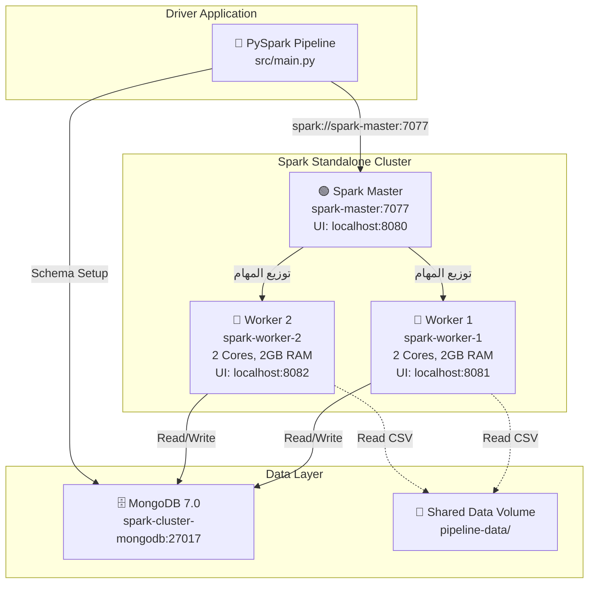
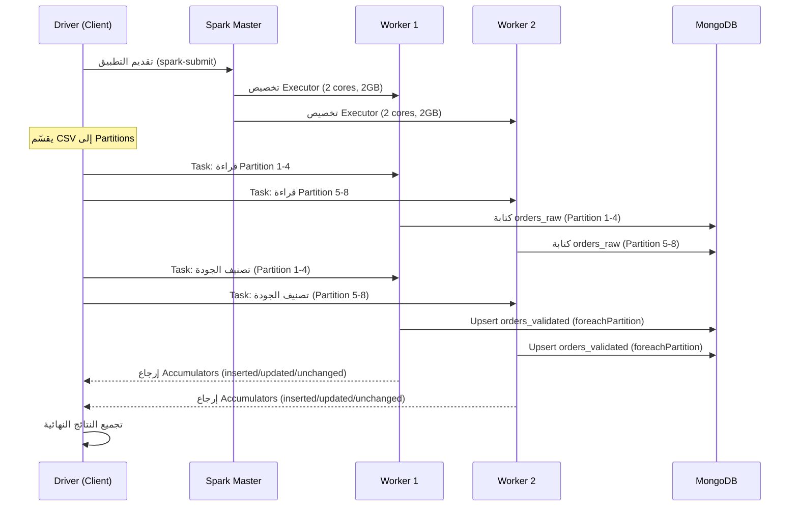

# 🖥️ دليل إعداد وتشغيل Spark Standalone Cluster الموزع

يوثق هذا الملف إعداد كلاستر Apache Spark Standalone الموزع الكامل لمشروع خط البيانات الهجين، بما في ذلك تشغيل Master و Workers على عقد منفصلة، توحيد الإصدارات، مشاركة البيانات، ومقارنة الأداء.

---

## 📋 جدول المحتويات
1. [معمارية الكلاستر](#1-معمارية-الكلاستر)
2. [متطلبات البيئة وتوحيد الإصدارات](#2-متطلبات-البيئة-وتوحيد-الإصدارات)
3. [إعداد وتشغيل الكلاستر](#3-إعداد-وتشغيل-الكلاستر)
4. [مشاركة البيانات بين العقد](#4-مشاركة-البيانات-بين-العقد)
5. [تشغيل Pipeline عبر الكلاستر](#5-تشغيل-pipeline-عبر-الكلاستر)
6. [واجهة Spark Master UI](#6-واجهة-spark-master-ui)
7. [مقارنة الأداء Local vs Cluster](#7-مقارنة-الأداء)
8. [توزيع الأدوار بين Master و Workers](#8-توزيع-الأدوار)
9. [استكشاف الأخطاء](#9-استكشاف-الأخطاء)

---

## 1. معمارية الكلاستر



### توزيع الأدوار

| العقدة | الدور | المسؤولية |
|---|---|---|
| **Spark Master** | مُنسّق (Coordinator) | جدولة الـ Jobs، توزيع Tasks على Workers، مراقبة الحالة عبر Web UI |
| **Worker 1** | مُنفّذ (Executor) | تنفيذ الـ Tasks الموزعة (قراءة CSV، تصنيف الجودة، كتابة MongoDB) |
| **Worker 2** | مُنفّذ (Executor) | نفس Worker 1 — يعالج partitions مختلفة من البيانات بالتوازي |
| **MongoDB** | تخزين (Storage) | يستقبل الكتابة من جميع Workers ويوفر Unique Index و Schema Validation |
| **Driver** | قائد التطبيق | يُرسل الـ Application إلى Master ويُنسّق التدفق العام |

---

## 2. متطلبات البيئة وتوحيد الإصدارات

### ⚠️ شرط أساسي: توحيد الإصدارات عبر جميع العقد

يجب أن تكون الإصدارات التالية **متطابقة تماماً** على Master وجميع Workers:

| المكوّن | الإصدار المطلوب | التحقق |
|---|---|---|
| **Apache Spark** | 3.5.x | `spark-submit --version` |
| **Java (JDK)** | 17.x | `java -version` |
| **Python** | 3.11.x أو 3.12.x | `python3 --version` |
| **MongoDB Connector** | `mongo-spark-connector_2.13-10.4.0` | ملفات JARs في `jars/` |
| **BSON** | 4.8.2 | `bson-4.8.2.jar` |
| **MongoDB Driver Core** | 4.8.2 | `mongodb-driver-core-4.8.2.jar` |
| **MongoDB Driver Sync** | 4.8.2 | `mongodb-driver-sync-4.8.2.jar` |
| **MongoDB Server** | 7.0+ | `mongosh --eval "db.version()"` |
| **PyMongo** | 4.8+ | `python3 -c "import pymongo; print(pymongo.__version__)"` |

> **ملاحظة**: Docker Compose يضمن توحيد الإصدارات تلقائياً لأن جميع العقد تستخدم نفس الـ Image (`bitnami/spark:3.5`).

### التحقق الآلي من توحيد الإصدارات

```bash
# بعد تشغيل الكلاستر:
bash scripts/cluster_start.sh

# سيطبع تلقائياً إصدارات Java/Python/Spark لكل عقدة
```

---

## 3. إعداد وتشغيل الكلاستر

### الطريقة 1: Docker Compose (الموصى بها)

```bash
# 1. تشغيل الكلاستر الكامل (Master + 2 Workers + MongoDB)
bash scripts/cluster_start.sh

# 2. التحقق من الحالة
docker compose -f cluster/docker-compose.yml ps

# 3. إيقاف الكلاستر
bash scripts/cluster_stop.sh
```

### الطريقة 2: أجهزة فعلية / VMs منفصلة

إذا كنت تستخدم أجهزة منفصلة:

```bash
# === على العقدة الرئيسية (Master) ===
export SPARK_HOME=/opt/spark
cp cluster/spark-env.sh $SPARK_HOME/conf/
cp cluster/spark-defaults.conf $SPARK_HOME/conf/

# تعديل SPARK_MASTER_HOST إلى IP الفعلي
sed -i "s/spark-master/$(hostname -I | awk '{print $1}')/" $SPARK_HOME/conf/spark-env.sh

# تشغيل Master
$SPARK_HOME/sbin/start-master.sh

# === على كل عقدة عمل (Worker) ===
export SPARK_HOME=/opt/spark
# نسخ نفس الملفات + JARs + البيانات
$SPARK_HOME/sbin/start-worker.sh spark://MASTER_IP:7077
```

### ملفات الإعداد

| الملف | الموقع | الغرض |
|---|---|---|
| [`docker-compose.yml`](../cluster/docker-compose.yml) | `cluster/` | تعريف خدمات الكلاستر |
| [`spark-env.sh`](../cluster/spark-env.sh) | `cluster/` | متغيرات بيئة Spark |
| [`spark-defaults.conf`](../cluster/spark-defaults.conf) | `cluster/` | إعدادات Spark الافتراضية |
| [`workers`](../cluster/workers) | `cluster/` | قائمة عناوين العمال |

---

## 4. مشاركة البيانات بين العقد

### المشكلة
عند تشغيل الكلاستر الموزع، يجب أن يتمكن كل Worker من الوصول إلى ملف البيانات المصدر (CSV).

### الحل المُطبّق: Docker Shared Volumes

```yaml
# في docker-compose.yml — كل عقدة تشارك نفس المجلد:
volumes:
  - ../data:/opt/bitnami/spark/pipeline-data:ro    # بيانات CSV
  - ../jars:/opt/bitnami/spark/pipeline-jars:ro    # JARs المشتركة
  - ../src:/opt/bitnami/spark/pipeline-src:ro      # كود المشروع
```

### بدائل لبيئة الإنتاج

| الطريقة | الوصف | الاستخدام |
|---|---|---|
| **Docker Volumes** | مجلد مشترك عبر volumes | ✅ مستخدم حالياً |
| **NFS Mount** | مجلد شبكي (Network File System) | بيئات الإنتاج |
| **HDFS** | نظام ملفات Hadoop الموزع | كلاسترات كبيرة |
| **scp / rsync** | نسخ الملفات يدوياً لكل عقدة | بيئات بسيطة |
| **S3 / MinIO** | تخزين كائنات سحابي | بيئات سحابية |

---

## 5. تشغيل Pipeline عبر الكلاستر

### التشغيل المباشر
```bash
# تعيين متغيرات البيئة للكلاستر
export SPARK_MASTER="spark://spark-master:7077"
export MONGO_URI="mongodb://spark-cluster-mongodb:27017"
export SPARK_EXECUTOR_MEMORY="2g"
export SPARK_DRIVER_MEMORY="2g"

# تشغيل المعالجة
python3 src/main.py --input data/orders_1m.csv --force-engine pyspark
```

### التشغيل عبر spark-submit
```bash
docker exec spark-master /opt/bitnami/spark/bin/spark-submit \
    --master spark://spark-master:7077 \
    --deploy-mode client \
    --jars /opt/bitnami/spark/pipeline-jars/mongo-spark-connector_2.13-10.4.0.jar,\
/opt/bitnami/spark/pipeline-jars/bson-4.8.2.jar,\
/opt/bitnami/spark/pipeline-jars/bson-record-codec-4.8.2.jar,\
/opt/bitnami/spark/pipeline-jars/mongodb-driver-core-4.8.2.jar,\
/opt/bitnami/spark/pipeline-jars/mongodb-driver-sync-4.8.2.jar \
    --conf "spark.mongodb.write.connection.uri=mongodb://spark-cluster-mongodb:27017/orders_pipeline" \
    --conf "spark.executor.memory=2g" \
    /opt/bitnami/spark/pipeline-src/main.py \
    --input /opt/bitnami/spark/pipeline-data/orders_1m.csv \
    --force-engine pyspark
```

---

## 6. واجهة Spark Master UI

### عناوين الوصول

| الواجهة | العنوان | الغرض |
|---|---|---|
| **Spark Master UI** | `http://localhost:8080` | حالة الكلاستر، Workers، التطبيقات |
| **Worker 1 UI** | `http://localhost:8081` | تفاصيل Worker 1 والـ Executors |
| **Worker 2 UI** | `http://localhost:8082` | تفاصيل Worker 2 والـ Executors |
| **Application UI** | `http://localhost:4040` | Jobs, Stages, Tasks أثناء التنفيذ |

### ما يجب التحقق منه في واجهة Master UI

1. **صفحة Workers**: ظهور عقدتي العمل بحالة `ALIVE` مع عدد الأنوية والذاكرة المخصصة
2. **صفحة Running Applications**: ظهور `hybrid-orders-pipeline` أثناء التنفيذ
3. **صفحة Completed Applications**: ظهور التطبيق بعد الانتهاء مع عدد Executors

### ما يجب التحقق منه في Application UI (port 4040)

1. **Jobs**: قائمة الـ Jobs المُنفّذة (Read CSV, Write Raw, Classify, Upsert)
2. **Stages**: مراحل كل Job مع عدد Tasks
3. **Tasks**: توزيع Tasks على Executors مختلفة (Worker 1 و Worker 2)
4. **Executors**: عدد 2 executor (واحد لكل Worker) مع الذاكرة المستخدمة

### لقطات الشاشة المطلوبة

أماكن حفظ اللقطات:
```
docs/screenshots/
├── 01_master_ui_workers.png      # صفحة Workers في Master UI
├── 02_master_ui_application.png  # التطبيق أثناء التنفيذ
├── 03_app_ui_jobs.png            # قائمة Jobs
├── 04_app_ui_stages.png          # مراحل Job
├── 05_app_ui_tasks.png           # توزيع Tasks على Executors
├── 06_app_ui_executors.png       # تفاصيل Executors
└── 07_benchmark_results.png      # نتائج المقارنة
```

---

## 7. مقارنة الأداء

### تشغيل المقارنة الآلية
```bash
# توليد 1M سجل + تشغيل المقارنة
bash scripts/cluster_start.sh --generate-data
bash scripts/run_cluster_benchmark.sh
```

### النتائج المتوقعة

| الوضع | عدد السجلات | عدد الأنوية | الزمن المتوقع |
|---|---|---|---|
| **Local [*]** | 1,000,000 | جميع أنوية الجهاز | ~3-8 دقائق |
| **Cluster (2 Workers)** | 1,000,000 | 4 أنوية (2×2) | ~2-6 دقائق |

> **ملاحظة**: على نفس الجهاز الفعلي (Docker)، الفرق قد يكون طفيفاً بسبب مشاركة الموارد. الفرق الحقيقي يظهر عند استخدام أجهزة منفصلة أو زيادة عدد Workers.

### تقرير المقارنة
يُحفظ تلقائياً في: [`reports/cluster_benchmark.md`](../reports/cluster_benchmark.md)

---

## 8. توزيع الأدوار



---

## 9. استكشاف الأخطاء

### Worker لا يظهر في Master UI
```bash
# التحقق من لوقات Worker
docker logs spark-worker-1
docker logs spark-worker-2

# التحقق من اتصال الشبكة
docker exec spark-worker-1 ping spark-master -c 3
```

### خطأ في الاتصال بـ MongoDB
```bash
# التحقق من وصول Workers إلى MongoDB
docker exec spark-worker-1 python3 -c "
from pymongo import MongoClient
c = MongoClient('mongodb://spark-cluster-mongodb:27017', serverSelectionTimeoutMS=3000)
print(c.server_info()['version'])
"
```

### JARs غير موجودة
```bash
# التحقق من وجود JARs في كل عقدة
docker exec spark-worker-1 ls /opt/bitnami/spark/pipeline-jars/
docker exec spark-worker-2 ls /opt/bitnami/spark/pipeline-jars/
```

### إعادة تشغيل الكلاستر
```bash
bash scripts/cluster_stop.sh
bash scripts/cluster_start.sh
```
